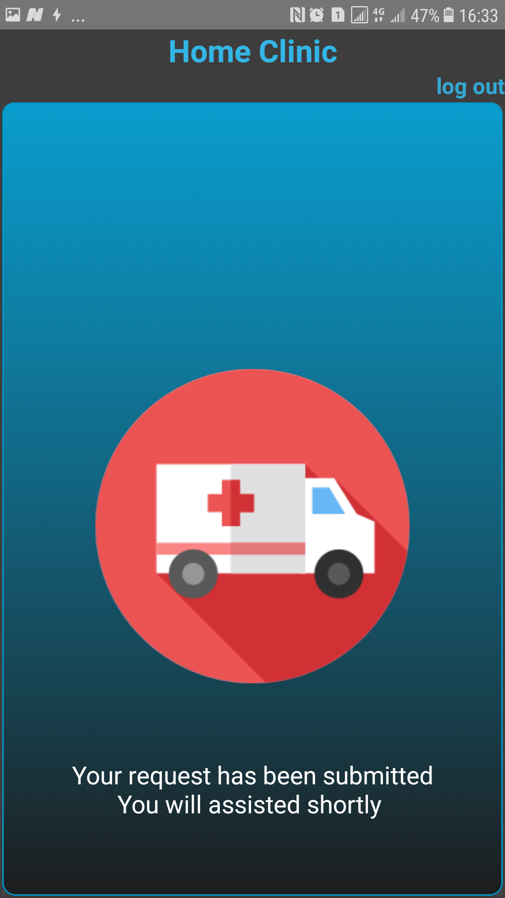

# homeclinic

The app has 4 icons, the home icon enables the user to get medication. The user just puts symptoms of what she's experiencing then the app suggests medication or seeing a doctor when necessary. It also has a chat where one can chat with a medical doctor  

The emergency Button when clicked immediately sends notification to the nearest clinic /ambulance service. 

The clinic button works to help the user get the information about the clinics around her. One can also order ambulance from it, see clinic rates, rating, level and even medics qualifications  .

The help button seeks to educate the user on how to use the application

You can sign up or just use this details: 
email: muguma12@yahoo.com
password: muguma

 

 

 

